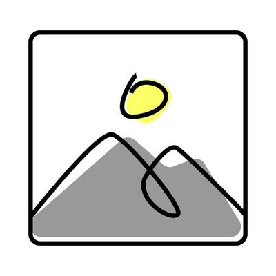

# VMaaS Network High Level Design

## 1. Overview
- **Objective:** Define the network design for Virtual Machine as a Service (VMaaS) running on OpenShift Virtualization.
- **Scope:** VM connectivity, VLAN trunking, MultiNetworkPolicy, ingress/egress, performance and HA.
- **Non-Goals:** Application-level network configuration.

## 2. Network Topology
- **Primary pod network:** used for cluster services (OVN-Kubernetes).
- **Secondary networks:** provided via Multus, connected using VLAN trunking.
- **VLAN allocation:** each Business Group (BG) maps to one or more VLANs.
- **IPAM strategy:** static/dynamic pools managed per namespace.

### Diagram

## 3. Multi-Network Support
- **Multus CNI:** attach multiple interfaces per VM.
- **NAD (NetworkAttachmentDefinition):** defines VLAN-backed networks.
- **Use cases:**
  - Isolated tenant networks.
  - Shared services networks (backup, monitoring).
- **Constraints:** multiple BGs may share a VLAN/subnet.

## 4. Network Security Policies
- **Baseline rules:** applied across all namespaces.
- **Tenant rules:** BGs define their own MultiNetworkPolicies.
- **Enforcement:** IP-based (no NSX-style tags).
- **Segmentation strategy:** namespace isolation + VLAN separation.

## 5. Ingress & Egress
- **Ingress:** via OpenShift routes, LoadBalancer services, or dedicated Ingress VMs.
- **Egress:** NAT gateways or egress firewall policies.
- **North-south control:** firewall rules enforced at cluster edge.
- **DNS:** centralized service per cluster.

## 6. High Availability & Performance
- **Redundant physical NICs:** bonded for failover.
- **Trunk uplinks:** multiple uplinks per node for resiliency.
- **MTU considerations:** jumbo frames for storage/backup networks.
- **QoS:** priority handling for critical services.

## 7. Testing & Validation
- **Connectivity matrix:** verify inter-VM and inter-namespace reachability.
- **Performance tests:** measure bandwidth, latency, jitter.
- **Failure simulations:** node NIC down, switch failure.
- **Conformance tests:** validate NADs and MultiNetworkPolicies.

## 8. Risks & Open Items
- VLAN/subnet overlap between BGs.
- Limited policy granularity (IP-only enforcement).
- Pending decision: centralized vs. decentralized IPAM.

## 9. References
- [OpenShift Multus CNI Docs](https://docs.openshift.com/container-platform/latest/networking/multiple_networks/understanding-multiple-networks.html)
- Tesco internal ADRs
