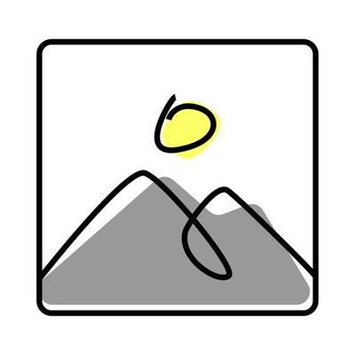

# TKS Network Design

## 1. Topology
- **Cluster CIDRs:** <pod, service, node>
- **CNI/SDN:** <OVN-Kubernetes, Multus, Calico, etc.>
- **Physical connectivity:** <uplinks, switches, routers>
- **Regions / zones:** <multi-AZ / on-prem / hybrid notes>

## 2. Multus & VLANs
- **Secondary interfaces:** trunk links, VLAN mapping
- **NetworkAttachmentDefinitions (NADs):** <examples>
- **IPAM strategy:** <static vs dynamic, pools, ranges>
- **Tenant VLAN allocation:** <approach for Tesco BGs>

## 3. Policies
- **MultiNetworkPolicy usage:** <baseline rules, tenant-specific rules>
- **Segmentation:** how multiple BGs are separated on shared VLANs
- **Baseline rules:** global deny/allow, default isolation
- **Tenant overrides:** <customization boundaries>

## 4. Ingress / Egress
- **Ingress controllers:** TLS termination, WAF integration
- **North-south traffic:** NAT, firewalls, egress policies
- **East-west traffic:** service-to-service security
- **L7 policies:** rate limiting, API gateways

## 5. Security & Compliance
- **Micro-segmentation:** <how workloads are isolated>
- **Identity-aware networking:** <if applicable>
- **Audit & logging:** <flow logs, SIEM integrations>
- **Regulatory alignment:** <PCI/GDPR implications>

## 6. Testing & Validation
- **Connectivity tests:** <ping, curl, netpol tests>
- **Performance tests:** throughput, latency, jitter
- **Failover tests:** simulate NIC/switch/router failures
- **Conformance:** CNCF, OpenShift, or internal Tesco standards

## 7. Diagrams
- **Logical network view:** 
- **Physical connectivity:** 
- **Policy example:** 

## 8. Risks & Open Items
- <list risks and decisions still pending>
